# 先进控制课程报告：倒立摆（Cart-Pole）PID、LQR、模糊控制与MPC 对比实验

一个统一的 Python 仿真平台，对比四类控制方法：PID、LQR、模糊控制与MPC，在小角度稳摆与位置抑制任务下进行一致性评估。支持动画展示、统一对比三联图与指标导出。

### 无控制（参考基线）
<div align="center">
  
</div>
<p align="center">
  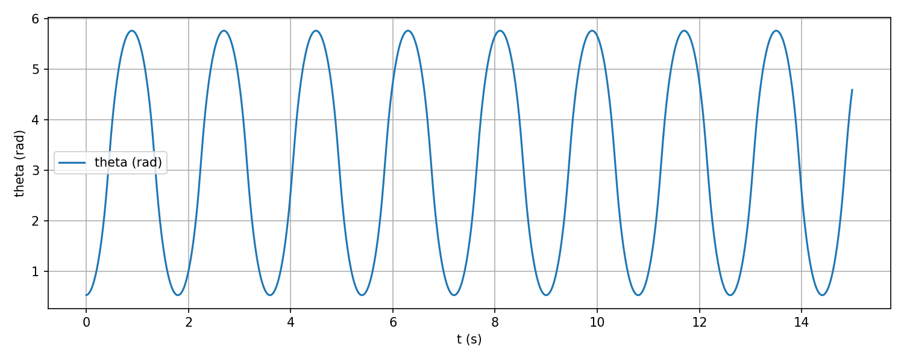
  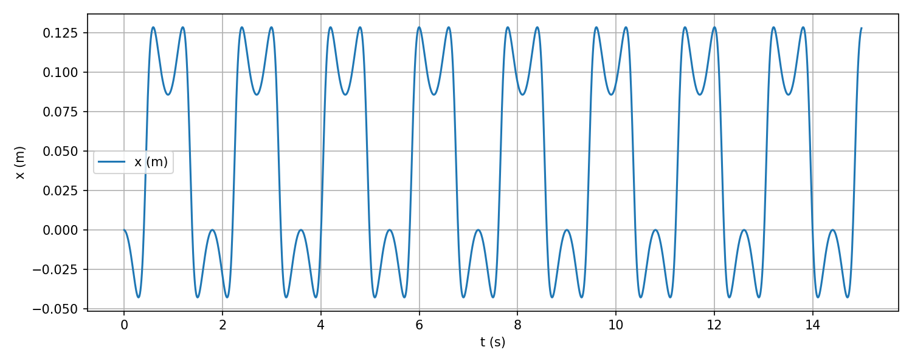
  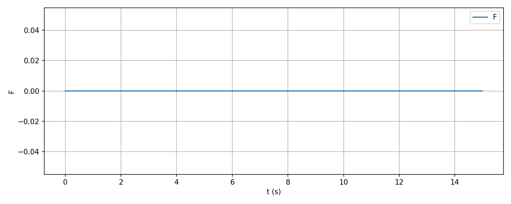
</p>

### PID 控制
<div align="center">
  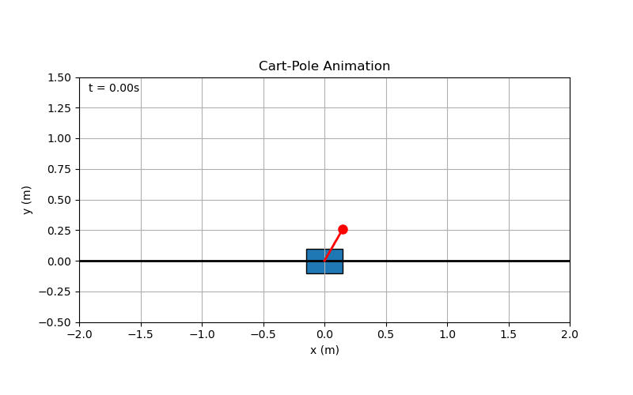
</div>
<p align="center">
  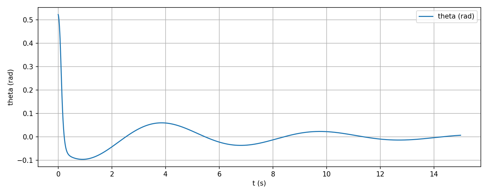
  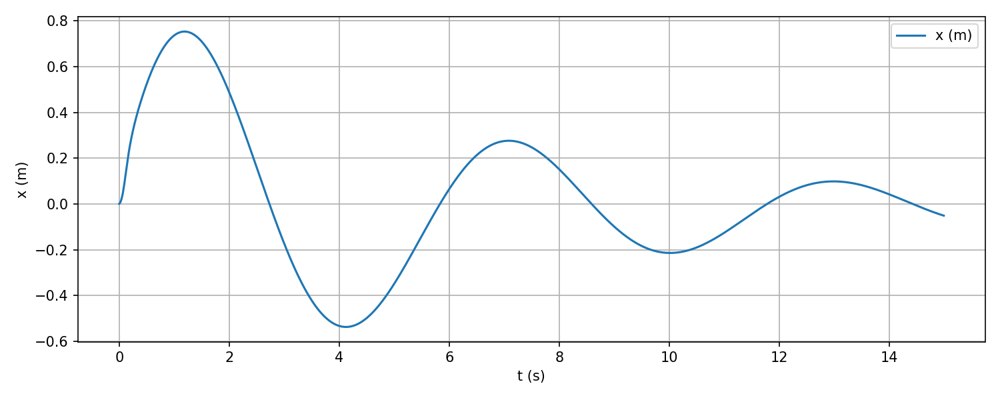
  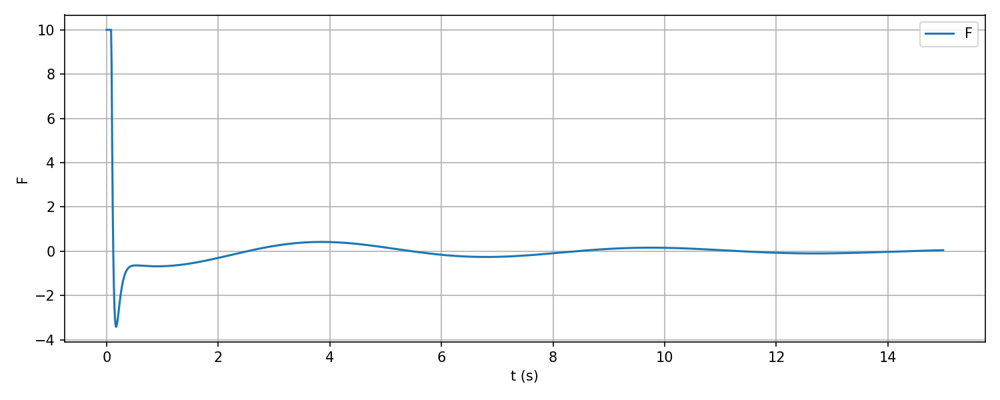
</p>

### LQR 控制
<div align="center">
  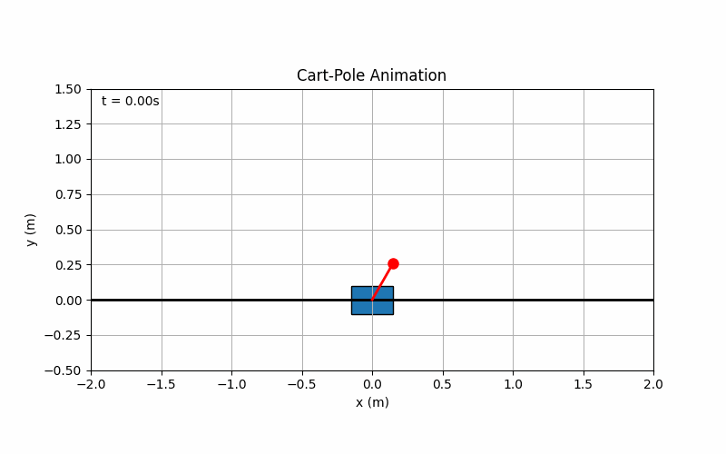
</div>
<p align="center">
  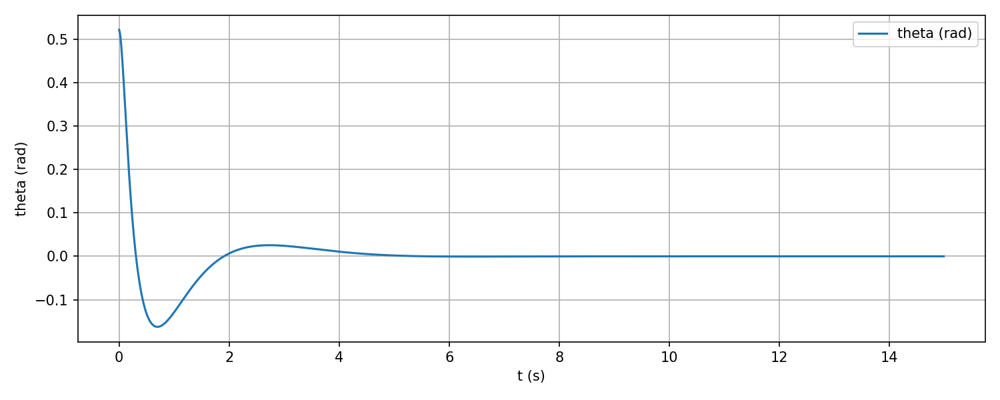
  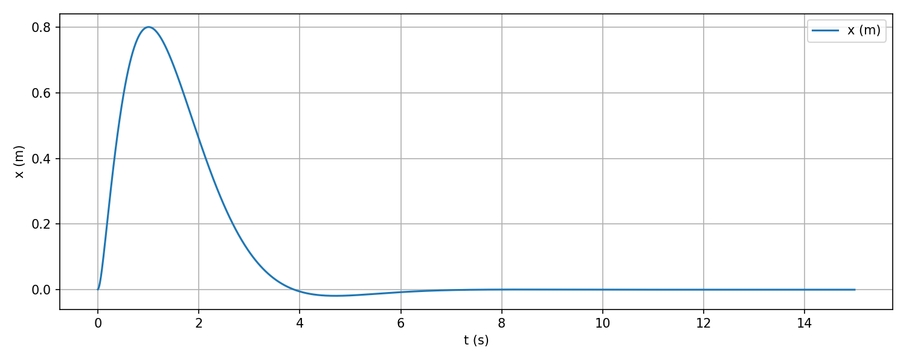
  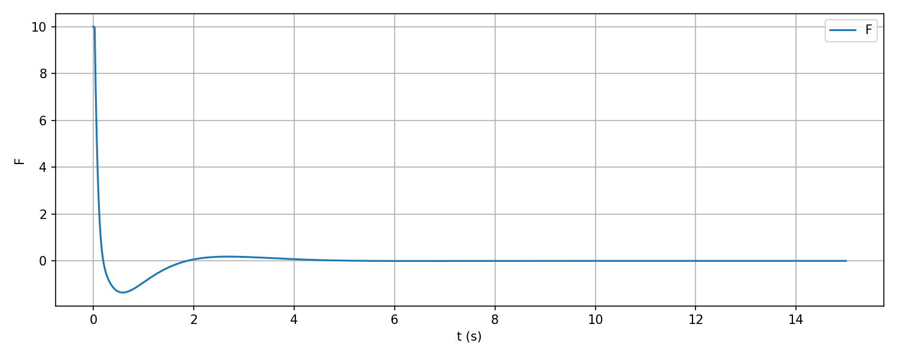
</p>

### MPC 控制
<div align="center">
  
</div>
<p align="center">
  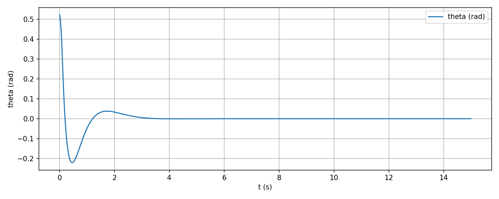
  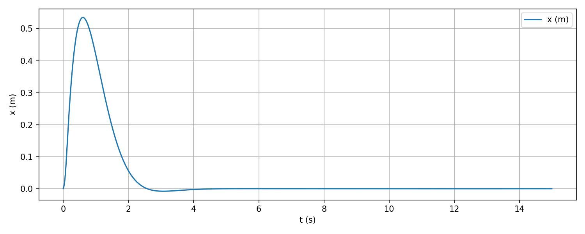
  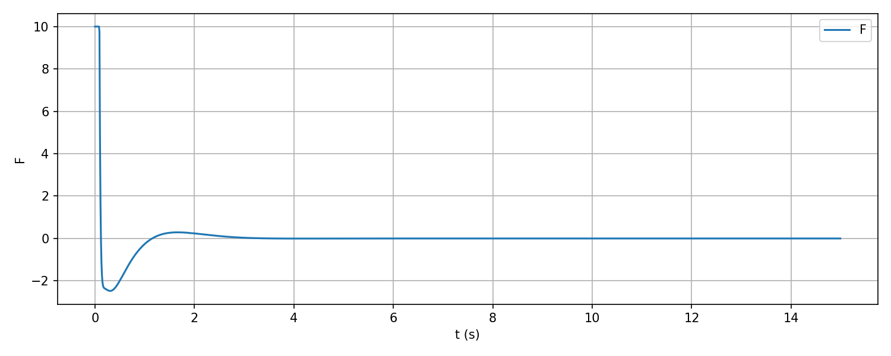
</p>

### 模糊控制
<div align="center">
  
</div>
<p align="center">
  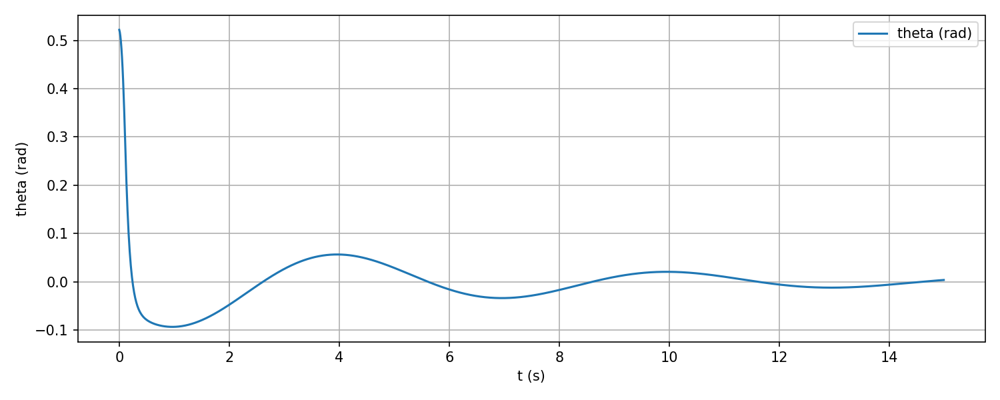
  
  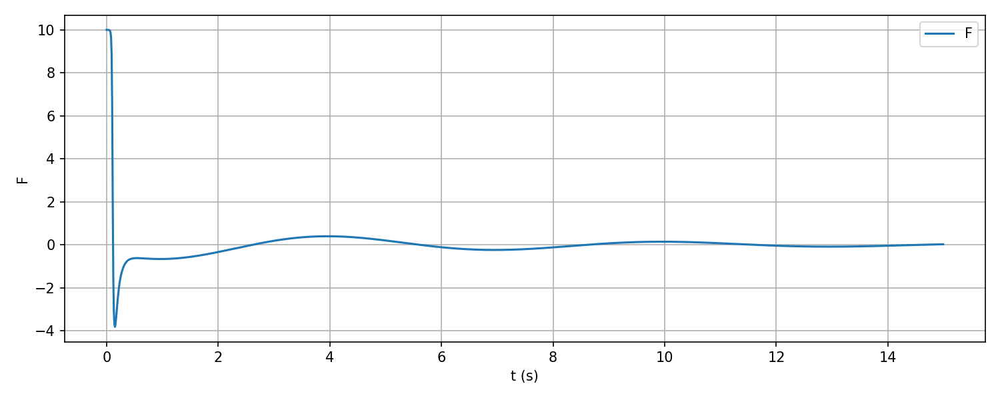
</p>

## 目录结构
- `models/` 倒立摆非线性动力学与数值步进
- `controllers/` 四类控制器实现：`pid.py`、`lqr.py`、`fuzzy.py`、`mpc.py`
- `experiments/` 动画与统一对比脚本：`animate_cartpole.py`、`run_scenarios.py`
- `results_*` 运行输出：动画轨迹、状态与力曲线、统一对比图与指标CSV
- `main.py` 菜单式入口（含动画与统一对比）
- `先进控制基础课程报告.pdf` 课程报告


## 快速开始
- 菜单入口：`python main.py`，运行后根据菜单选择不同功能：
``` shell
=== 倒立摆演示 主菜单 ===
1) 动画：无控制（开环）
2) 动画：模糊控制器
3) 动画：PID控制器
4) 动画：LQR控制器
5) 动画：MPC控制器
6) 统一对比仿真（模糊/PID/LQR/MPC）
0) 退出
请选择（数字）：6
```